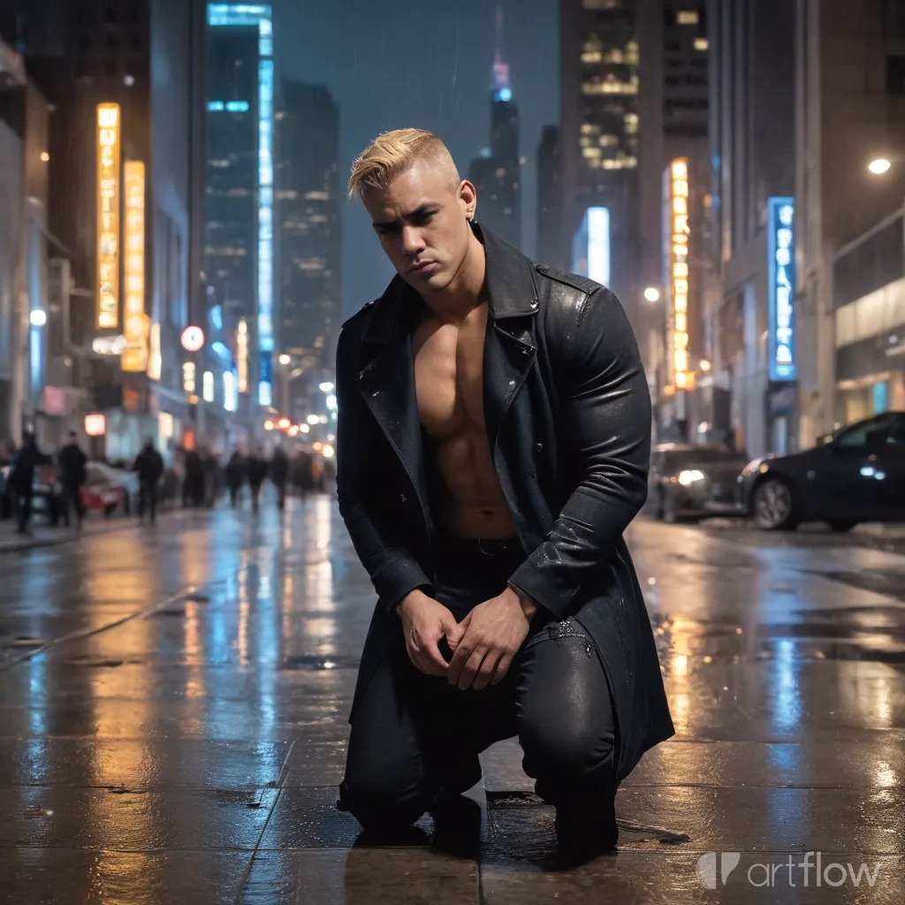

# 📸 Cómo Subir la Foto de Perfil

## Paso 1: Preparar la Imagen

La foto que compartiste necesita ser guardada en la carpeta correcta:

### Ubicación:
```
d:\RegalíasDirectas\assets\images\profile.jpg
```

### Recomendaciones de Edición (Estilo Canva):

1. **Recorte Vertical:** 
   - Proporción: 2:3 (ejemplo: 600x900px o 800x1200px)
   - Enfoque en tu figura completa o de cintura hacia arriba

2. **Ajustes de Imagen:**
   - Brillo: +10%
   - Contraste: +15%
   - Saturación: +5%
   - Nitidez: Sutil

3. **Marco Profesional:**
   - Opcional: Agregar borde de 2-3px color #667eea (morado del sitio)
   - O dejarlo sin marco (recomendado - el CSS ya tiene borde)

4. **Tamaño Final:**
   - Ancho: 600-800px
   - Alto: 900-1200px
   - Peso: < 500KB (optimizado para web)
   - Formato: JPG con calidad 85-90%

## Paso 2: Guardar la Imagen

### Opción A: Manualmente
1. Guarda tu foto como `profile.jpg`
2. Cópiala a: `d:\RegalíasDirectas\assets\images\`

### Opción B: Usando Canva (Recomendado)

1. **Abrir Canva:**
   - Ir a https://www.canva.com
   - Crear diseño personalizado: 600x900px

2. **Cargar tu foto:**
   - Uploads → Subir la imagen del cantante
   - Arrastrar a la canvas

3. **Ajustar:**
   - Posicionar centrada
   - Aplicar filtro "Enhance" si quieres
   - Opcional: Agregar efecto de viñeta sutil

4. **Efectos Profesionales (opcionales):**
   - Background: Mantener el fondo original
   - Ajustar: Brillo +10, Contraste +15
   - Temperatura: Cálida (naranja) para match con la foto

5. **Descargar:**
   - Share → Download
   - Tipo: JPG
   - Calidad: Recomendada
   - Guardar como `profile.jpg`

## Paso 3: Subir al Proyecto

```powershell
cd "d:\RegalíasDirectas"
git add assets/images/profile.jpg
git commit -m "Agregada foto de perfil de Odry-M"
git push
```

## 🎨 Alternativa: Editar con Photoshop

Si prefieres usar Photoshop:

1. Abrir imagen
2. Recortar a 600x900px (Image → Canvas Size)
3. Adjustments:
   - Levels (Ctrl+L): Ajustar punto medio a 1.1
   - Vibrance: +10
   - Sharpen: Smart Sharpen al 50%
4. File → Export → Save for Web (Legacy)
   - JPG, Quality: 85
   - Guardar como `profile.jpg`

## ✅ Verificación

Una vez subida la imagen, verifica en:
- Local: `file:///d:/RegalíasDirectas/index.html`
- Online (después de push): https://omm2022.github.io/regalias-artisticas/

La imagen aparecerá en la pestaña "👤 Acerca de" con:
- Border radius de 20px
- Sombra morada
- Efecto hover (se eleva al pasar el mouse)
- Borde de 4px color morado

## 🖼️ Placeholder Temporal

Mientras subes la imagen real, el sitio mostrará un placeholder con el texto "Odry-M".

---

**Nota:** La imagen ya está referenciada en el código como:
```html

```

Solo falta que copies el archivo físico a esa ubicación.
